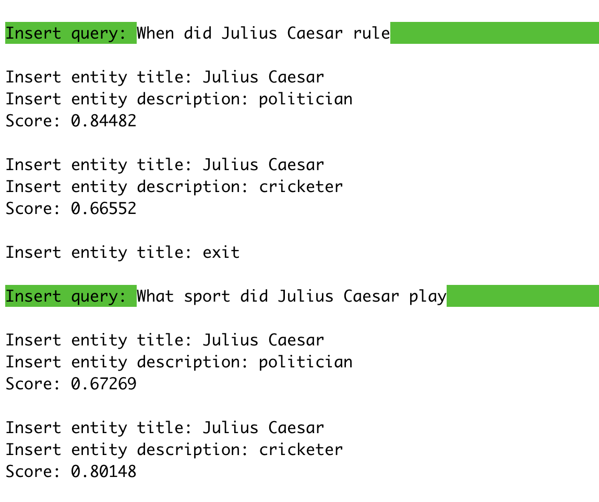

# TABi: Type-Aware Bi-Encoders for Open-Domain Entity Retrieval

This repo contains an implementation of TABi, a bi-encoder for entity retrieval that trains over knowledge graph types and unstructured text. TABi introduces a type-enforced contrastive loss to encourage query and entity embeddings to cluster by type in the embedding space. 
You can find more details in our [paper](https://arxiv.org/abs/2204.08173).

This repo also includes [pre-trained TABi models](#2-download-tabi-models) to retrieve Wikipedia pages from queries and [training scripts](#train-your-own-tabi-model) to train TABi models on new datasets.

## Setup

### 1. Installation 
Our code is tested on Python 3.7. We recommend installing with a virtualenv. 

```bash
pip install -r requirements.txt
pip install -e . 
```

If you are using NVIDIA A100 GPUs, you will need to install a version of PyTorch that supports the `sm_80` CUDA architecture: 
```bash 
pip install torch==1.10.1+cu111 torchvision==0.11.2+cu111 torchaudio==0.10.1 -f https://download.pytorch.org/whl/torch_stable.html
```

### 2. Download TABi models

We provide the following pre-trained TABi models. We also provide the pre-computed entity embeddings over the [KILT-E](#3-download-the-knowledge-base-kilt-e) knowledge base. ***The pre-computed entity embeddings require 16GB of disk space to download.***

We provide models that are trained with types using the type-enforced contrastive loss and models that are trained without types. Note that the models trained on the BLINK training data require mention boundaries (or mention detection, e.g. via [flair](https://github.com/flairNLP/flair)) at test time. This is because all examples in the BLINK training data have mention boundaries. 

<table><tbody>
<!-- START TABLE -->
<!-- TABLE HEADER -->
<th valign="center">Training Data</th>
<th valign="center">Trained with Types</th>
<th valign="center">Weights</th>
<th valign="center">Entity Embs</th>

<!-- TABLE BODY -->
<tr>
<td valign="center">KILT</td>
<td valign="center">Yes</td>
<td valign="center"><a href="https://storage.googleapis.com/tabi_release/models/kilt_type/best_model.pth">url</a></td></td>
<td valign="center"><a href="https://storage.googleapis.com/tabi_release/models/kilt_type/embs.npy">url</a></td>
</tr>

<tr>
<td valign="center">KILT</td>
<td valign="center">No</td>
<td valign="center"><a href="https://storage.googleapis.com/tabi_release/models/kilt_no_type/best_model.pth">url</a></td></td>
<td valign="center"><a href="https://storage.googleapis.com/tabi_release/models/kilt_no_type/embs.npy">url</a></td>
</tr>

<tr>
<td valign="center">BLINK</td>
<td valign="center">Yes</td>
<td valign="center"><a href="https://storage.googleapis.com/tabi_release/models/blink_type/best_model.pth">url</a></td>
<td valign="center"><a href="https://storage.googleapis.com/tabi_release/models/blink_type/embs.npy">url</a></td>
</tr>

<tr>
<td valign="center">BLINK</td>
<td valign="center">No</td>
<td valign="center"><a href="https://storage.googleapis.com/tabi_release/models/blink_no_type/best_model.pth">url</a></td>
<td valign="center"><a href="https://storage.googleapis.com/tabi_release/models/blink_no_type/embs.npy">url</a></td>
</tr>
</tbody></table>    

See our [paper](https://arxiv.org/abs/2204.08173) for hyperparameter settings for the pre-trained models. 

### 3. Download the knowledge base (KILT-E)

We use a filtered version of the [KILT](https://github.com/facebookresearch/KILT) knowledge base. We remove Wikimedia internal items (e.g. disambiguation pages, list articles) and add [FIGER types](https://www.aaai.org/ocs/index.php/AAAI/AAAI12/paper/viewFile/5152/5124) to entities where available. The final knowledge base, KILT-Entity (KILT-E) has 5.45 million entities corresponding to English Wikipedia pages.

Download KILT-E: 
- jsonlines: [entity.jsonl](https://storage.googleapis.com/tabi_release/data/entity.jsonl)
- pickle: [entity.pkl](https://storage.googleapis.com/tabi_release/data/entity.pkl)

Both formats can be used for `entity_file` in the following commands, but the pickle will load a bit faster.  

## Use TABi interactively 

We support two modes to use TABi interactively. We recommend using the models trained on KILT for the interactive mode since it does not currently support mention detection or providing mention boundaries. 

### Standard retrieval mode

To retrieve entities from a pre-computed entity index, run: 
```bash
python scripts/demo.py --model_checkpoint best_model.pth --entity_emb_path embs.npy --entity_file entity.pkl
```

Example: 


To control the number of retrieved entities, use the flag `--top_k`. By default, the top 10 entities will be returned. 

### Entity-input mode 
To input your own entities (title and description) and get a score between the query and your entity, simply provide the model checkpoint: 
```bash
python scripts/demo.py -model_checkpoint best_model.pth
```

Example: 



The scores provided are cosine similarities and will be between -1 and 1 (1 is most similar). The demo will continue to prompt you for entities. To enter a new query and entities, type `exit`. 

<!-- ## Use TABi in your codebase 

TABi can be incorporated into your code base... 
 -->

## Prepare data for TABi 
We include AmbER and KILT datasets for evaluation and BLINK and KILT datasets for training in the TABi data format in [Datasets](#datasets). If you plan to use our provided datasets, you can skip to [Evaluation](#evaluate-tabi) and [Training](#train-your-own-tabi-model).

### TABi data format

We require that the input to TABi be in the following format: 
```python
{
    "id": # unique example id  
    "text": # question or sentence 
    "label_id": # list of gold knowledge base ids if available, otherwise use [-1]
    "alt_label_id": # list of lists of alternate gold knowledge base ids, if none use [[]] 
    "mentions": # list of character spans of mention boundaries if available, otherwise [] 
}
```
Example (from [Natural Questions](https://github.com/google-research-datasets/natural-questions)): 
```python
{
    "id": "-143054837169120955",
    "text": "where are the giant redwoods located in california", 
    "label_id": [903760], 
    "alt_label_id": [[4683290, 2526048, 242069]], 
    "mentions": []
}
```
Note that if providing mention spans, TABi currently only supports disambiguating one mention at a time and will run separate evaluation queries on the model for each mention span in the list.

### Preprocessing 
To convert a jsonlines file in the [KILT](https://github.com/facebookresearch/KILT#kilt-data-format) data format to the TABi data format, run: 
```bash
python scripts/preprocess_kilt.py --entity_file entity.pkl --input_file nq-dev-kilt.jsonl --output_file nq-dev-tabi.jsonl
```
To convert a directory of KILT-formatted files to the TABi format, run: 
```bash
python scripts/preprocess_kilt.py --entity_file entity.pkl --input_dir kilt_dev --output_dir kilt_dev_tabi
```

## Evaluate TABi 

The evaluation script runs the model eval, reports `accuracy@1` and `accuracy@10`, and saves the predictions in KILT-formatted files. 

To evaluate a TABi model, run: 
```bash
python tabi/eval.py --test_data_file nq-dev-kilt.jsonl --entity_file entity.pkl --model_checkpoint best_model.pth --entity_emb_path embs.npy --mode eval --log_dir logs
```
- `log_dir` specifies where the log file and prediction file are written. 
- You can also specify the name for the prediction file with `--predfile`. For instance: 
```bash
python tabi/eval.py --test_data_file nq-dev-kilt.jsonl --entity_file entity.pkl --model_checkpoint best_model.pth --entity_emb_path embs.npy --mode eval --log_dir logs --pred_file nq-dev-preds.jsonl
```

For benchmarks, we use the evaluation scripts provided by [AmbER](https://github.com/anthonywchen/AmbER-Sets/tree/main/evaluation) and [KILT](https://github.com/facebookresearch/KILT/blob/main/kilt/eval_retrieval.py) to report final numbers. 

## Train your own TABi model

Training consists of a multi-step procedure. 

1. Train with local in-batch negatives.
2. Extract entity embeddings. 
3. Extract hard negatives using nearest neighbor search with [optional hard negative filtering](#filtering-negatives).  
4. Train with in-batch negatives and hard negatives.

An example script is in [scripts/run_sample.py](scripts/run_sample.py). To run with the small sample data in the repo on a GPU: 
```bash
python scripts/run_sample.py
```
To run with the small sample data in the repo on a CPU: 
```bash
python scripts/run_sample_cpu.py
```

### Train on a new dataset

To train a new TABi model on your own dataset, make sure to format your training, eval, and test datasets in the [TABi data format](#tabi-data-format) and modify `data_dir`, `train_file`, `dev_file`, and `test_file` in the [example script](scripts/run_sample.py). 

To use a new entity knowledge base, each entity in the knowledge base (jsonlines file) should have the following format: 
```python
{
    "label_id": # unique id of the entity (optional, if not provided, row in knowledge base is assigned as the id)
    "title": # title of the entity 
    "text": # description of the entity 
    "types": # list of types ([] if none) 
    "wikipedia_page_id": # wikipedia page id (can exclude if not linking to Wikipedia) 
}
```
See [KILT-E knowledge base](#3-download-the-knowledge-base-kilt-e) for an example of the expected format. The type-enforced contrastive loss uses query types, which are  assigned as the types associated with the gold entity for the query. It is important that the "types" are not all empty in the knowledge base in order to see benefits from the type-enforced contrastive loss. Make sure to update `entity_file` in the [example script](scripts/run_sample.py) to use your new knowledge base. 

### Train on KILT or BLINK datasets 

We provide example scripts to train a new TABi model on the [BLINK](scripts/run_blink_data.py) and [KILT](scripts/run_kilt_data.py) datasets. The datasets for training can be downloaded [below](#retrieval-datasets). The provided pre-trained models were trained on 16 A100 GPUs for four epochs, which took approximately 9 and 11 hours total for the BLINK and KILT datasets, respectively.

### Distributed training

We support [DistributedDataParallel](https://pytorch.org/docs/stable/notes/ddp.html) training on a single node with multiple GPUs. See the example scripts above for training on BLINK and KILT data using distributed training. You may need to increase the ulimit (number of open files) on your machine for large datasets using `ulimit -n 100000`.

### Filtering hard negatives by frequency 

We have support for filtering hard negatives, following the procedure described in [Botha et al.](https://arxiv.org/abs/2011.02690). The goal is to balance the frequency an entity occurs as a hard negative relative to the frequency an entity occurs in the training dataset as a gold entity. Filtering can help reduce the proportion of hard negatives that are rare entities. To use filtering, we provide the `--filter_negatives` flag. We only recommend this frequency-based filtering procedure for *large* training datasets (e.g. BLINK or KILT). On small training datases, most entities may have very low or zero counts, leading to aggressive filtering.  

## Retrieval datasets 

### Evaluation
We provide evaluation files in the TABi data format for the [AmbER](https://github.com/anthonywchen/AmbER-Sets/) and [KILT](https://github.com/facebookresearch/KILT) benchmarks. For KILT, we include the 8 open-domain tasks: 
- [AmbER](https://storage.googleapis.com/tabi_release/data/amber-sets.zip)
- [AmbER (GOLD)](https://storage.googleapis.com/tabi_release/data/amber-sets-gold.zip)
- [KILT (dev)](https://storage.googleapis.com/tabi_release/data/kilt-dev.zip)
- [KILT (test)](https://storage.googleapis.com/tabi_release/data/kilt-test.zip) 

The ids for the dev/test splits we use for AmbER in our paper can be found [here](https://storage.googleapis.com/tabi_release/data/amber-sets-splits.zip). 

### Training 

We provide training and validation files in the TABi data format for: 
- [KILT (train)](https://storage.googleapis.com/tabi_release/data/kilt_train.jsonl) (11.7M examples) 
- [KILT (dev - combined)](https://storage.googleapis.com/tabi_release/data/kilt_dev.jsonl) (35.8K examples) 
- [BLINK (train)](https://storage.googleapis.com/tabi_release/data/blink_train.jsonl) (8.4M examples)
- [BLINK (dev)](https://storage.googleapis.com/tabi_release/data/blink_dev.jsonl) (9.9K examples)


## Citation 
If you find this code useful, please cite the following paper:

```bibtex
@inproceedings{leszczynski-etal-2022-tabi,
    title={{TAB}i: {T}ype-Aware Bi-Encoders for Open-Domain Entity Retrieval}, 
    author={Megan Leszczynski and Daniel Y. Fu and Mayee F. Chen and Christopher R\'e}, 
    booktitle={Findings of the Association of Computational Linguistics: ACL 2022}, 
    year={2022}
}
```

## Acknowledgments 

Our work was inspired by the following repos: 
- https://github.com/facebookresearch/BLINK 
